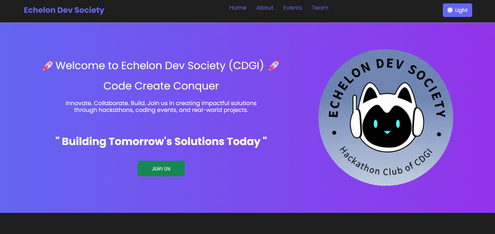

# 🚀 Echelon Dev Society Landing Page 



> **"Building Tomorrow's Solutions Today"**  

Welcome to the official landing page of **Echelon Dev Society (CDGI)** — a community of developers, innovators, and tech enthusiasts.  
This project includes the main landing page for the society and a detailed HackWave 2.0 event page.
## 🚀 Visit Our Webpage
[](https://echelon-dev-six.vercel.app/)

---

## 📌 Table of Contents
- [Overview](#overview)  
- [Features](#features)  
- [Technologies Used](#technologies-used)  
- [Project Structure](#project-structure)  
- [Screenshots](#screenshots)  
- [Installation](#installation)  
- [Usage](#usage)  
- [Contributing](#contributing)  
- [Contact](#contact)  
- [License](#license)  

---

## 🌟 Overview
The **Echelon Dev Society Landing Page** introduces students to the society’s mission, team, and events.  
The **HackWave 2.0 Page** provides detailed information about one of the society’s biggest hackathons, including mentors, prizes, and registration links.

These pages are designed to be **responsive, modern, and visually engaging**, with smooth animations, dark mode toggle, and mobile-friendly navigation.

---
## ✨ Key Features

- 🧑‍💻 **About Section** – Introduction to Echelon Dev Society and its goals.  
- 🗓️ **Upcoming Events** – Displays upcoming hackathons, workshops, and meetups.  
- 🎞️ **Sliding Memories** – An auto-sliding gallery featuring past event photos and memories.  
- 📰 **News Section** – Latest updates, achievements, and announcements.  
- 👥 **Team Section** – Showcases society members and organizers.  
- 📬 **Contact Section** – Allows visitors to reach out easily.  
- 📱 **Responsive Design** – Optimized for desktop, tablet, and mobile.  
- 🎨 **Smooth Animations** – Clean transitions and fade-in effects for modern UI.
- 🧑‍💻 **Chat-Bot**

---
## 🎯 Features
### Landing Page
- Hero section with welcome message, slogan, and **Join Us** button.
- About Us section explaining the mission and vision.
- Events section showcasing HackWave 2.O, Dev Hacks, Tech Talks, and Tech Sessions.
- Team section introducing society members with photos and roles.
- Footer with social media links (Instagram, GitHub, LinkedIn).
- Dark mode toggle and hamburger menu for mobile navigation.
- Smooth fade-in animations for an engaging UX.

### HackWave 2.0 Page
- Event hero section with catchy tagline: **"Ride the Wave of Innovation 🌊"**.
- Detailed event description highlighting the hackathon format and goals.
- Mentors section with bios and images of HackWave mentors.
- Prizes section with visually appealing cards for 1st, 2nd, and 3rd prizes.
- Registration section with a **Register Now** button linking to the registration form.

---

## 💻 Technologies Used
- **HTML5** – Semantic markup  
- **CSS3** – Styling and layout  
- **Bootstrap 5** – Responsive grid and components  
- **JavaScript** – Dark mode toggle and interactive functionality  
- **Font Awesome** – Icons for social media and UI  
- **Google Fonts (Poppins)** – Typography  
- **Images & Assets** – Event banners, mentor photos, team photos  

---
---

## 🖼 Screenshots (Some)

### Landing Page Hero Section


### HackWave 2.0 Hero Section


---

## ⚡ Installation
1. **Clone the repository**:
```bash
git clone https://github.com/anub1004/Echelon-Dev-Webpage.git
```

2. **Navigate to the project folder:**:
  ``` bash
 cd Echelon-Dev-Webpage
 ```
3. **Open the landing page::**:
 ``` bash
  start index.html   # Windows
open index.html    # Mac
```
## 📂 Project Structure
``` bash
Echelon-Dev-Webpage/
│
├── assets/
│ ├── echleon_edited.png
│ ├── hackwave.png
│ ├── dev hacks.jpg
│ ├── webtalk.png
│ ├── image.png
│ ├── mentor1.png
│ ├── mentor2.png
│ └── mentor3.png
│
├── Css/
│ ├── style.css
│ └── hackwave.css
│
├── script.js
├── index.html # Main landing page
├── hackwave.html # HackWave 2.0 event page
└── README.md
```
## 🚀 Usage

- Explore Home, About, Events, and Team sections on the main landing page.

- Click Join Us to access the registration form.

- View HackWave 2.0 details including mentors, prizes, and registration.

- Use Dark Mode Toggle to switch themes 

- Use hamburger menu for navigation on mobile devices.
## 📱 Visit

- [Click here to visit Echelon Dev Society Instagram](https://www.instagram.com/echelondevsociety/?__pwa=1)


- [Click here to visit Echelon Dev Society](https://www.linkedin.com/company/echelondevsociety/)


**Developed By:** Anubhav Singh


